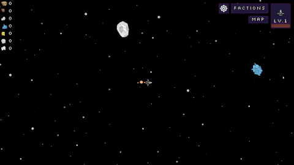
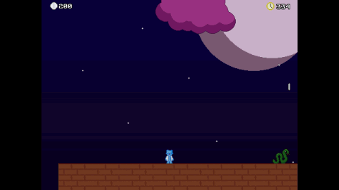
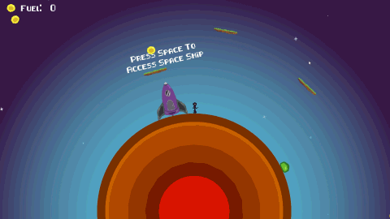

<!DOCTYPE html>
<html class="no-js" lang="en">

<head>
    <meta charset="utf-8">
    <meta http-equiv="X-UA-Compatible" content="IE=edge">
    <meta name="viewport" content="width=device-width, initial-scale=1">
    <title>My Portfolio</title>
    <link rel="shortcut icon" href="favicon.ico" type="image/x-icon">
    <link rel="icon" href="favicon.ico" type="image/x-icon">
    <link rel="preconnect" href="https://fonts.gstatic.com">
    <link href="https://fonts.googleapis.com/css2?family=Rubik:wght@600&display=swap" rel="stylesheet">
    <link rel="stylesheet" href="libs/font-awesome/css/font-awesome.min.css">
    <link href="css/bootstrap.min.css" rel="stylesheet">
    <link href="css/styles.css" rel="stylesheet">
</head>

<body>
    

        <i class="fa fa-bars" aria-hidden="true"></i>
    

    <!-- End #mobile-menu-toggle -->
    <header>
        

            Close <i class="fa fa-times" aria-hidden="true"></i>
        

        <ul id="menu" class="shadow">
            <li>
                <a href="#about">About</a>
            </li>
            <li>
                <a href="#experience">Experience</a>
            </li>
            <li>
                <a href="#education">Education</a>
            </li>
            <li>
                <a href="#projects">Projects</a>
            </li>
            <li>
                <a href="#skills">Skills</a>
            </li>
            <li>
                <a href="#contact">Contact</a>
            </li>
        </ul>
    </header>
    <!-- End header -->

    

        

            <h1>Guy Dadon</h1>
            <h2>Software Developer</h2>
            <a href="#" class="btn-rounded-white">Download Resume</a>
        

        <!-- End #lead-content -->

        

        

            
                <i class="fa fa-chevron-down" aria-hidden="true"></i>
            
        

        <!-- End #lead-down -->
    

    <!-- End #lead -->

    

        

            

                

                    <h2 class="heading">About Me</h2>
                

                

                    

                        Lorem ipsum dolor sit amet, consectetur adipiscing elit. Curabitur in iaculis ex. Etiam volutpat
                        laoreet urna. Morbi ut tortor nec nulla commodo malesuada sit amet vel lacus. Fusce eget efficitur
                        libero. Morbi dapibus porta quam laoreet placerat.
                    

                

            

        

    

    <!-- End #about -->

    

        <h2 class="heading">Experience</h2>
        

            

                <h3>Bonna inc.</h3>
                <h4>Software Developer</h4>
                

                    Lorem ipsum dolor sit amet, consectetur adipiscing elit. Curabitur in iaculis ex. Etiam volutpat
                    laoreet urna. Morbi ut tortor nec nulla commodo malesuada sit amet vel lacus. Fusce eget efficitur
                    libero. Morbi dapibus porta quam laoreet placerat.
                

            

            

                <h3>Modiin ezrahi (מודיעין אזרחי)</h3>
                <h4>Security Guard</h4>
                

                    Security guard in the main buildings of social security (ביטוח לאומי).
                

            

        

    

    <!-- End #experience -->

    

        <h2 class="heading">Education</h2>
        

            <h3>John Bryce</h3>
            November 2017 - January 2019
            <h4>FullStack Java, One year (354 hours)</h4>
            

            <h4>final project — Coupon management system Grade - 97</h4>
            <ul>
                <li>
                    Back-end: Spring Boot backend working with MSSQL and MySql through JPA.
                    Front-end: Angular 6 + Bootstrap single page application with a login page and a custom design for
                    each
                    end user type.
                </li>
                <li>
                    All basic functionalities for admin, company and customer.
                    Security filters and math utilities.
                </li>
            </ul>
            

        

        <!-- End .education-block -->

        

            <h3>ORT Givat Ram</h3>
            Sept 2007 - Sept 2010
            <h4>Electronics & Computer Science</h4>
            <ul>
                <li>
                    High school graduate with electives Electronics and computer science
                    expanding on english translation, C and Java.
                </li>
                <li>
                    Lorem ipsum dolor sit amet, consectetur adipiscing elit.
                </li>
                <li>
                    Lorem ipsum dolor sit amet, consectetur adipiscing elit.
                </li>
            </ul>
        

        <!-- End .education-block -->
    

    <!-- End #education -->

    

        <h2 class="heading">Projects</h2>
        

            

                

                    

                        
                    

                    <!-- End .project-image -->
                    

                        <h3>Moon Prosody</h3>
                        

                            Lorem ipsum dolor sit amet, consectetur adipiscing elit. Curabitur in iaculis ex. Etiam
                            volutpat laoreet urna. Morbi ut tortor nec nulla commodo malesuada sit amet vel lacus. Fusce
                            eget efficitur libero. Morbi dapibus porta quam laoreet placerat.
                        

                        <a href="#">View Project</a>
                    

                    <!-- End .project-info -->
                

                <!-- End .project -->

                

                    

                        
                    

                    <!-- End .project-image -->
                    

                        <h3>COSMONAV</h3>
                        

                            Lorem ipsum dolor sit amet, consectetur adipiscing elit. Curabitur in iaculis ex. Etiam
                            volutpat laoreet urna. Morbi ut tortor nec nulla commodo malesuada sit amet vel lacus. Fusce
                            eget efficitur libero. Morbi dapibus porta quam laoreet placerat.
                        

                        <a href="#">View Project</a>
                    

                    <!-- End .project-info -->
                

                

                    

                        
                    

                    <!-- End .project-image -->
                    

                        <h3>Knowledge</h3>
                        

                            Lorem ipsum dolor sit amet, consectetur adipiscing elit. Curabitur in iaculis ex. Etiam
                            volutpat laoreet urna. Morbi ut tortor nec nulla commodo malesuada sit amet vel lacus. Fusce
                            eget efficitur libero. Morbi dapibus porta quam laoreet placerat.
                        

                        <a href="#">View Project</a>
                    

                    <!-- End .project-info -->
                

                

                    

                        
                    

                    <!-- End .project-image -->
                    

                        <h3>Super Nova</h3>
                        

                            Lorem ipsum dolor sit amet, consectetur adipiscing elit. Curabitur in iaculis ex. Etiam
                            volutpat laoreet urna. Morbi ut tortor nec nulla commodo malesuada sit amet vel lacus. Fusce
                            eget efficitur libero. Morbi dapibus porta quam laoreet placerat.
                        

                        <a href="#">View Project</a>
                    

                    <!-- End .project-info -->
                

                

                    

                        
                    

                    <!-- End .project-image -->
                    

                        <h3>Dont Stop Running</h3>
                        

                            Lorem ipsum dolor sit amet, consectetur adipiscing elit. Curabitur in iaculis ex. Etiam
                            volutpat laoreet urna. Morbi ut tortor nec nulla commodo malesuada sit amet vel lacus. Fusce
                            eget efficitur libero. Morbi dapibus porta quam laoreet placerat.
                        

                        <a href="#">View Project</a>
                    

                    <!-- End .project-info -->
                

                <!-- End .project -->
            

        

    

    <!-- End #projects -->

    

        <h2 class="heading">Skills</h2>
        <ul>
            <li>JavaScript</li>
            <li>Python</li>
            <li>Ruby</li>
            <li>Go</li>
            <li>Node.js</li>
            <li>AngularJs</li>
            <li>React</li>
            <li>Elixir</li>
            <li>Java</li>
            <li>C</li>
            <li>C#</li>
            <li>C++</li>
            <li>Ruby on Rails</li>
            <li>JavaScript</li>
            <li>Python</li>
            <li>Ruby</li>
            <li>Go</li>
            <li>Node.js</li>
            <li>AngularJs</li>
            <li>React</li>
            <li>Elixir</li>
            <li>Java</li>
            <li>C</li>
            <li>C#</li>
            <li>C++</li>
            <li>Ruby on Rails</li>
        </ul>
    

    <!-- End #skills -->

    

        <h2>Get in Touch</h2>
        

            <form method="POST" action="https://formspree.io/email@email.com">
                <input type="hidden" name="_subject" value="Contact request from personal website" />
                <input type="email" name="_replyto" placeholder="Your email" required>
                <textarea name="message" placeholder="Your message" required></textarea>
                <button type="submit">Send</button>
            </form>
        

        <!-- End #contact-form -->
    

    <!-- End #contact -->

    <footer>
        

            

                

                    

                        Guy Dadon
                    

                

                

                    
                        <i class="fa fa-chevron-up" aria-hidden="true"></i>
                    
                

                

                    <ul>
                        <li>
                            <a href="https://github.com/PapaCheese" target="_blank"><i class="fa fa-github"
                                    aria-hidden="true"></i></a>
                        </li>

                        <li>
                            <a href="https://www.linkedin.com/in/guy-dadon-024244167/" target="_blank"><i
                                    class="fa fa-linkedin" aria-hidden="true"></i></a>
                        </li>

                    </ul>
                

            

        

    </footer>
    <!-- End footer -->

    
    
</body>

</html>